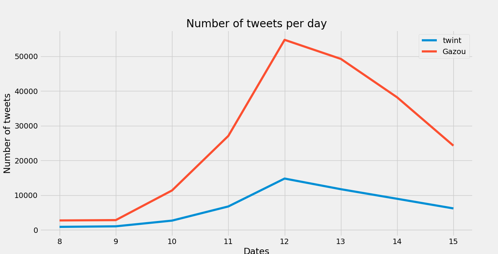
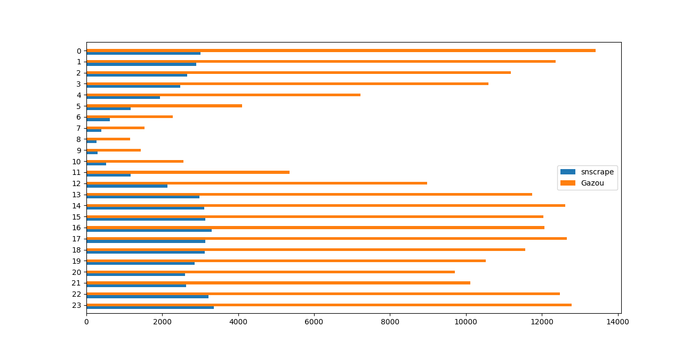
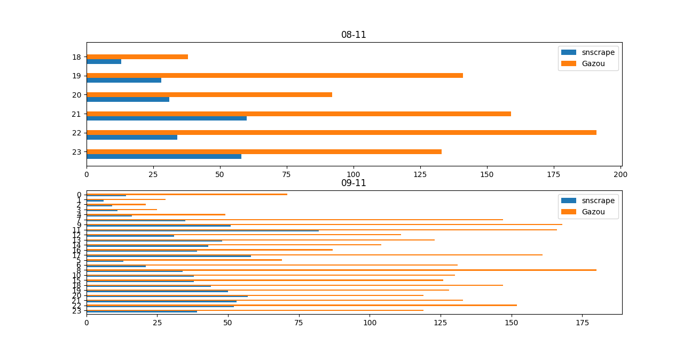
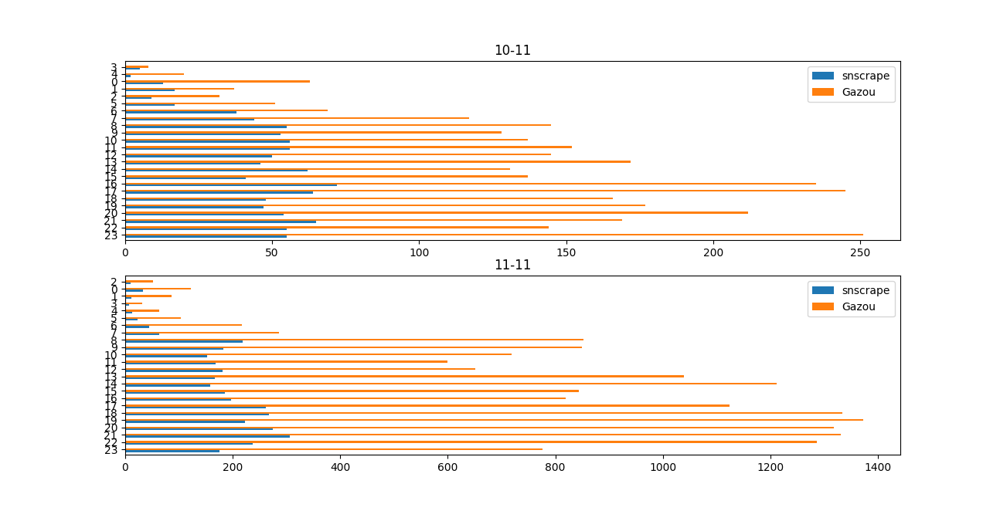
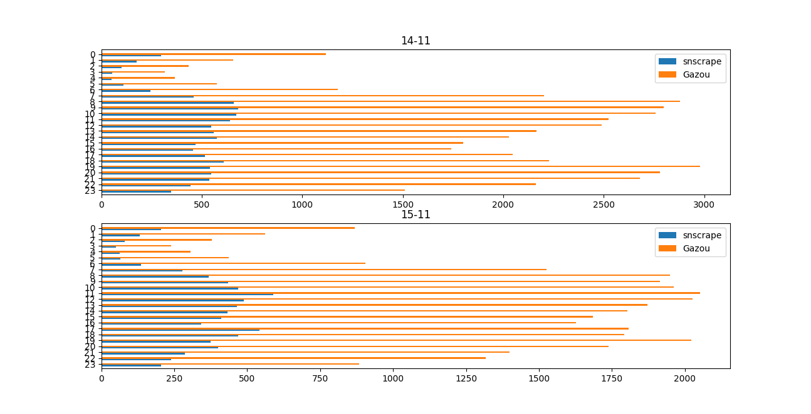
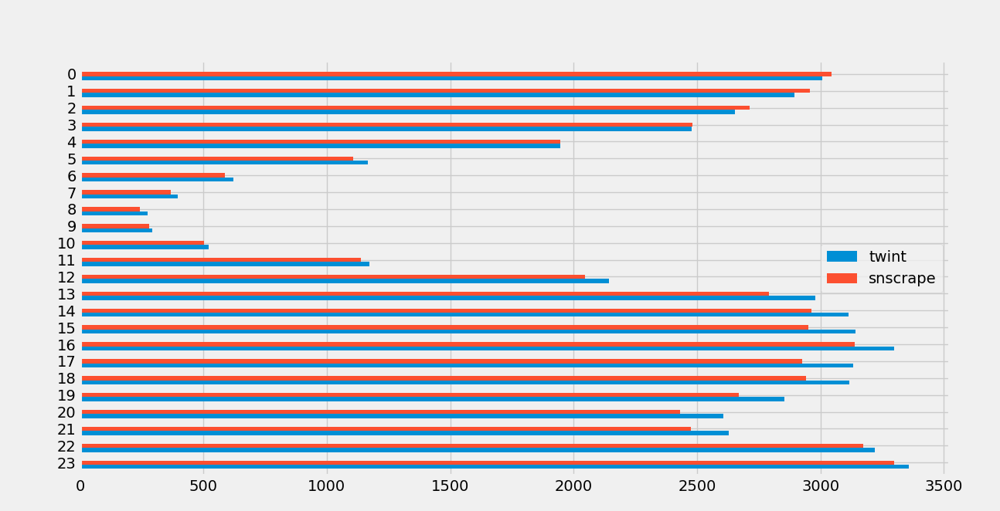
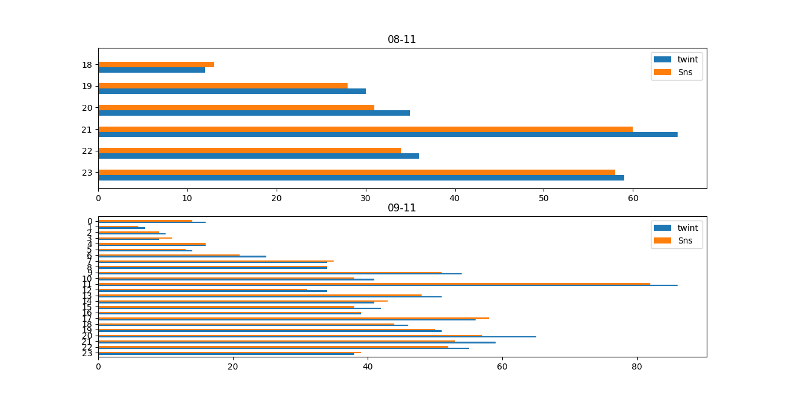
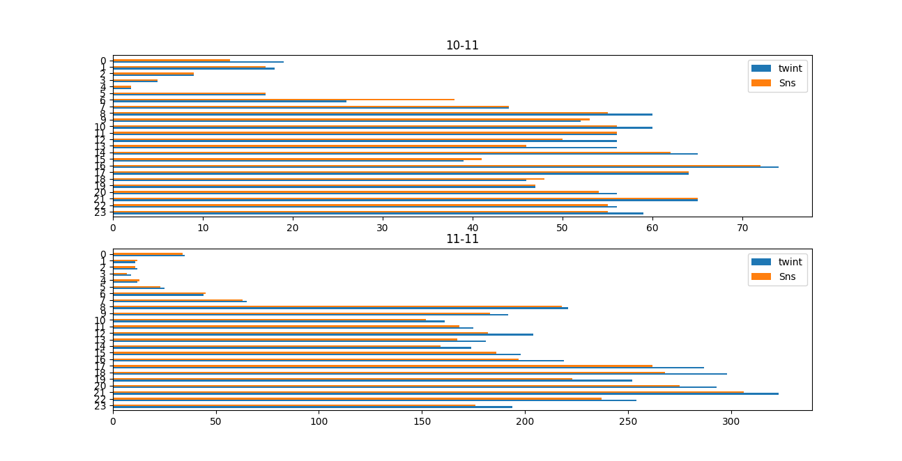
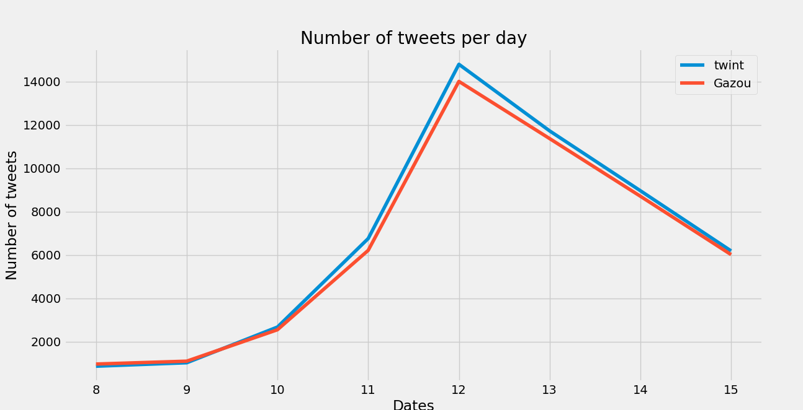
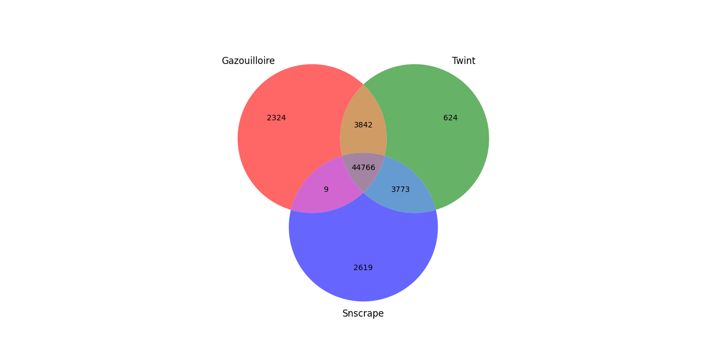

# Comparaison d'outils de récolte de tweets : Gazouilloire, Twint et Snscrape 

L'objet de ce document est de résumer une tentative de comparaison des outils de récoltes de tweets 
Gazouilloire (reposant sur l'API de twitter), Twint et Snscrape (scrapeurs twitter).
Les tweets furent récoltés à partir des mots-clefs suivants : 'Hold_Up' 'Hold-Up' 'Holdup' 'Holdup_ledoc' 'HoldUpStopLaPeur'. 
La comparaison des récoltes fut effectuée sur la période suivante : 08/11/2020 18:30:00 - 16/11/2020 18:30:00.


## Sommaire 

- [Installation/Configuration de Twint](#Installation/Configuration-de-Twint)
- [Installation/Configuration de Snscrape](#Installation-de-Snscrape)
- [Regularisation des données](#Normalisation-des-donnees)
- [Comparaison volumes captés](#1-Volumes)
 - [Twint-Gazouilloire](#1.1-Twint-Gazouilloire)
 - [Sns-Gazouilloire](#1.2-Sns-Gazouilloire)
 - [Twint-Sns](#1.3-Twint-Sns)
- [Analyse qualitative](#2-Qualitatif)
  -[Comparaison des fréquences d'apparitions](#2.1-Comparaison des fréquences d'apparitions)


## Installation/Configuration de Twint 

> pip install --user --upgrade git+https://github.com/twintproject/twint.git@origin/master#egg=twint

Il y a un problème de filtrage sur la langue qui nécessite une modification dans le fichier url.py 
> https://github.com/twintproject/twint/pull/1025
> Remplacer les lignes 102-103 du fichier url.py par 
> `q += f" lang:{config.Lang}"`

Une fois le changement effectué, depuis le répertoire cloné de git, lancer la commande suivante :
> pip install .

```python
import argparse
import twint

parser = argparse.ArgumentParser()
parser.add_argument('--kw',nargs="+", help="size a list of key_words")
parser.add_argument('--since', type=str, help="starting date YYYY-MM-DD HH:MM:SS", default="2020-11-19 20:30:00")
parser.add_argument('--until', type=str, help="ending date YYYY-MM-DD HH:MM:SS", default="2020-11-20 10:30:00")
args = parser.parse_args()

for keyword in args.kw :
    config = twint.Config()
    config.Search = keyword
    config.Lang = "fr"
    config.Since = args.since
    config.Until = args.until
    config.Store_csv = True
    config.Output = f"{keyword.strip()}.csv"
    twint.run.Search(config)
```

Les différents fichiers de recolte furent fusionnés à l'aide d'un script bash

## Installation de Snscrape

pip3 install git+https://github.com/JustAnotherArchivist/snscrape.git

Les différents fichiers de recolte furent fusionnés à l'aide d'un script bash

## Regularisation des données

Afin de pouvoir comparer les données, les données récoltés ont du être régularisées. Les dates furent toutes converties au format isoformat afin de faciliter leurs manipulations, comparaisons avec le module datetime. Les dates furent également réajustés pour Gazouilloire car pas au meme fuseau horaire que les deux scrapeurs. Dans le but d'obtenir le maximum de champ possible, la récolte des tweets avec Snscrape ne put s'enregister qu'au format json. Il 
a donc fallu également retranscrire le fichier en csv pour comparer les trois fichiers. Les tweets récupérés par 'thread_only' de Gazouilloire furent également supprimés. 

## Comparaison des volumes Captés

Dans un premier temps, les différentes récoltes furent comparés entre elles sur la différence des volumes de tweets captés par unité de temps. 
Les tweets furent d'abord agglomérées à la journée à laquelle ils furent publiées. Ensuite, à l'heure à laquelle ils furent publiées (sur l'ensemble de la récolte, puis enfin à la journée et à l'heure précise. 

### Twint-Gazouilloire






### Snscrape-Gazouilloire










### Twint-Snscrape









On notera que les deux scrapeurs suivent des tendances extremement similaires et que cette tendance commune est similaire à la tendance suivie par Gazouilloire à une échelle réduite. En moyenne, l'on constate effectivement que Gazouilloire récupère quatre fois plus de tweets que Twint ou Snscrape. 
<br/>

Cependant si l'on supprime les tweets labellisés comme étant des retweets dans la collecte de Gazouilloire, on retombe sur les mêmes ordres de grandeurs que pour les deux scrapeurs. On constate même qu'il semble que les deux scrapeurs soient sensiblement plus efficace que Gazouilloire. 



<br/>
<br/>



Si l'on représente maintenant le diagramme de Venn de la jointure des 3 fichiers de récolte (Rts supprimés) sur les ids des tweets, l'on constate qu'un peu plus de 12% des tweets passent sous le radar de Gazouilloire. 
Une première hypothèse fut qu . Rien en ce sens.
Une comparaison des fréquences pour les différents mots-clefs par jours fut entreprise et exposée ci-dessous. 


## 2 - Analyse qualitative

Dans un premier temps, puisque le volume de tweets non captés par Gazouilloire ne fut pas trop important, la cohérence des tweets fut vérifiée (présence des mots-clefs,
tweet en française, cohérence des dates.). La recherche d'un 'motif' particulier dans ces tweets fut également entreprise mais sans succès. 
A defaut, une analyse de la fréquence d'apparition des mots-clefs dans les tweets fut entreprise et exposée ci-dessous afin de faire ressortir éventuellement certaines tendances. 

### 2.1 Comparaison des fréquences d'apparitions 

La fréquence du mot clef Holdup_ledoc fut trop minime dans chaque récolte (voir = 0) pour être utile dans ces comparaisons. 
 
 On partitionne ici l'ensemble des tweets récoltés en deux.
 Pour chaque mots-clefs dans chaque partition, on regarde pour chaque tweet si il contient ou non le mot-clef testé. 
 On modélise ce décompte par deux variables aléatoire X et Y qui suivent toutes deux une loi binomiale de paramètres respectifs pX et pY. 
 L'on teste alors l'égalité pX = pY à l'aide d'un test d'homogénéité dont le détail est donné ci-dessous. 
 
 
 

Le seuil de significativité du test est ici choisi à 5%. 

On réalise ce test pour chaque mot-clef pour chaque jour de la récolte. 

Les résultats sont listés dans le tableau ci-dessous
 
|   Comparaison     |    Hold_Up | HoldUpStopLaPeur  | Hold-up| Holdup |
| ------------- |:-------------: |: -----: |:-----: |:-----: | -----:|
|Twint/Gazouilloire| 5/8 | 3/8 | 3/8 | 2/8 |
|Twint/snscrape | 8/8 | 5/8 | 6/8 | 8/8 |
|Sns/Gazouilloire| 6/8 | 5/8 | 5/8| 4/8 | 

Cette analyse, bien que sommaire, semble montrer que les proportions des tweets captés par les différents scrapeurs sont relativement homogènes en termes de fréquence d'apparition de mots-clefs comparés à Gazouilloire avec les deux scrapeurs (En particulier sur le mot-clef Holdup)
Il pourrait être intéressant d'analyser cette divergence plus en détails. 

## Conclusion

L'avantage principale de Gazouilloire par rapport aux scrapeurs Twint et Snscrape est sa capacité à récupérer les retweets. Cependant, il semblerait que 
les scrapeurs récupèrent sensiblement plus de tweets 'primaires' que Gazouilloire. 

