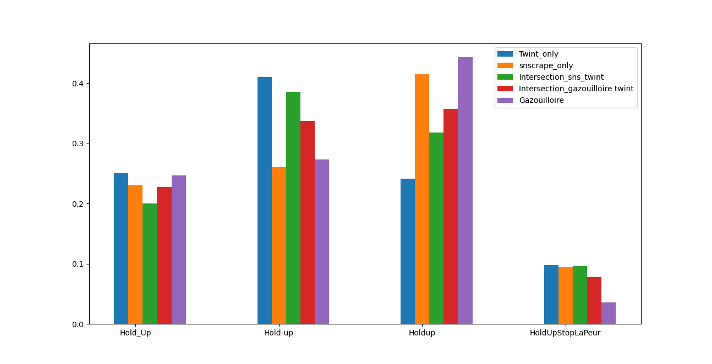

# Comparaison d'outils de récolte de tweets : Gazouilloire, Twint et Snscrape 

L'objet de ce document est de résumer une tentative de comparaison des outils de récoltes de tweets 
Gazouilloire (reposant sur l'API de twitter), Twint et Snscrape (scrapeurs twitter).
Les tweets furent récoltés à partir des mots-clefs suivants : 'Hold_Up' 'Hold-Up' 'Holdup' 'Holdup_ledoc' 'HoldUpStopLaPeur'. 
La comparaison des récoltes fut effectuée sur la période suivante : 08/11/2020 18:30:00 - 16/11/2020 18:30:00.

## Sommaire 

- [Installation/Configuration de Twint](#Installation/Configuration-de-Twint)
- [Installation/Configuration de Snscrape](#Installation-de-Snscrape)
- [Regularisation des données](#Normalisation-des-donnees)
- [Comparaison volumes captés](#1-Volumes)
 - [Twint-Gazouilloire](#1.1-Twint-Gazouilloire)
 - [Sns-Gazouilloire](#1.2-Sns-Gazouilloire)
 - [Twint-Sns](#1.3-Twint-Sns)
- [Analyse qualitative](#2-Qualitatif)
  -[Mots-clefs](#2.1-Mots-clefs)
    -[Frequence globale des mots-clefs](#2.1.1-Frequence-globale)
    -[Comparaison des fréquences journalières](#2.1.2-Frequences-journalieres)

## Installation/Configuration de Twint 

> pip install --user --upgrade git+https://github.com/twintproject/twint.git@origin/master#egg=twint

Il y a un problème de filtrage sur la langue qui nécessite une modification dans le fichier url.py 
> https://github.com/twintproject/twint/pull/1025
> Remplacer les lignes 102-103 du fichier url.py par 
> `q += f" lang:{config.Lang}"`

Une fois le changement effectué, depuis le répertoire cloné de git, lancer la commande suivante :
> pip install .

## Regularisation des données

Afin de pouvoir comparer les données, les données récoltés ont du être régularisées. Les dates furent toutes converties au format isoformat afin de faciliter leurs manipulations, comparaisons avec le module datetime. Les dates furent également réajustés pour Gazouilloire car pas au meme fuseau horaire que les deux scrapeurs. Dans le but d'obtenir le maximum de champ possible, la récolte des tweets avec Snscrape ne put s'enregister qu'au format json. Il 
a donc fallu également retranscrire le fichier en csv pour comparer les trois fichiers. Les tweets récupérés par 'thread_only' de Gazouilloire furent également supprimés. 

## Comparaison des volumes Captés

Dans un premier temps, les différentes récoltes furent comparés entre elles sur la différence des volumes de tweets captés par unité de temps. 
Les tweets furent d'abord agglomérées à la journée à laquelle ils furent publiées. Ensuite, à l'heure à laquelle ils furent publiées (sur l'ensemble de la récolte, puis enfin à la journée et à l'heure précise. 

### Twint-Gazouilloire

### Snscrape-Gazouilloire

### Twint-Snscrape

On notera que les deux scrapeurs suivent des tendances extremement similaires et que cette tendance commune est similaire à la tendance suivie par Gazouilloire à une échelle réduite. En moyenne, l'on constate effectivement que Gazouilloire récupère quatre fois plus de tweets que Twint ou Snscrape. 

 
 

Cependant si l'on représente le diagramme de Venn de la jointure des 3 fichiers de récolte sur les ids des tweets, l'on constate qu'un peu plus de 3% des tweets passent sous le radar de Gazouilloire. 
Une première hypothèse fut qu . Rien en ce sens.
Une comparaison des fréquences pour les différents mots-clefs par jours fut entreprise et exposée ci-dessous. 

## 2 - Analyse qualitative

Dans un premier temps, puisque le volume de tweets non captés par Gazouilloire ne fut pas trop important, la cohérence des tweets fut vérifiée (présence des mots-clefs,
tweet en française, cohérence des dates.). La recherche d'un 'motif' particulier dans ces tweets fut également entreprise mais sans succès. 
A defaut, une analyse de la fréquence d'apparition des mots-clefs dans les tweets fut entreprise et exposée ci-dessous afin de faire ressortir éventuellement
certaines tendances. 

### 2.1 Frequence globale des mots-clefs 

La fréquence du mot clef Holdup_ledoc fut trop minime dans chaque récolte (voir = 0) pour être utile dans ces comparaisons. 

 ### 2.2 Comparaison des fréquences journalières. 
 
 On partitionne ici l'ensemble des tweets récoltés en deux.
 Pour chaque mots-clefs dans chaque partition, on regarde pour chaque tweet si il contient ou non le mot-clef testé. 
 On modélise ce décompte par deux variables aléatoire X et Y qui suivent toutes deux une loi binomiale de paramètres respectifs pX et pY. 
 L'on teste alors l'égalité pX = pY à l'aide d'un test d'homogénéité dont le détail est donné ci-dessous. 
 
 
 

 
 #### Gazouilloire - Complémentaire de Gazouilloire
 
|   DATE        |      Mot-clef | Test - Egalité des proportions   |
| ------------- |:-------------:| -----:|
| 2020-11-08     | HoldUpStopLaPeur | Oui |
| 2020-11-09     | HoldUpStopLaPeur |  Oui |
| 2020-11-10  | HoldUpStopLaPeur   |   Non |
| 2020-11-11 | HoldUpStopLaPeur   |    Non |
| 2020-11-12  | HoldUpStopLaPeur   |    Oui |
| 2020-11-13 | HoldUpStopLaPeur   |    Non|
| 2020-11-14 | HoldUpStopLaPeur   |    Oui |
| 2020-11-15 | HoldUpStopLaPeur   |    Oui |
| 2020-11-08  | Holdup   |    Oui |
| 2020-11-09  | Holdup   |    Non |
| 2020-11-10  | Holdup   |    Non |
| 2020-11-11  | Holdup   |    Non |
| 2020-11-12  | Holdup   |    Non |
| 2020-11-13  | Holdup   |    Non |
| 2020-11-14  | Holdup   |    Non |
| 2020-11-15  | Holdup   |    Non |
| 2020-11-08  | Hold-up  |    Non |
| 2020-11-09  | Hold-up  |    Oui |
| 2020-11-10  | Hold-up  |    Non |
| 2020-11-11  | Hold-up  |    Non |
| 2020-11-12  | Hold-up  |    Non |
| 2020-11-13  | Hold-up  |    Non |
| 2020-11-14  | Hold-up  |    Non |
| 2020-11-15  | Hold-up  |    Oui |
| 2020-11-08 | Hold_Up  |    Oui |
| 2020-11-09 | Hold_Up  |    Oui |
| 2020-11-10  | Hold_Up  |    Oui |
| 2020-11-11 | Hold_Up  |    Oui |
| 2020-11-12  | Hold_Up  |    Oui |
| 2020-11-13  | Hold_Up  |    Non |
| 2020-11-14  | Hold_Up  |    Non |
| 2020-11-15  | Hold_Up  |    Non |

Ainsi, il semblerait que les proportions des tweets contenant les mots-clefs 'Holdup' et 'Hold-up' sont bien différentes entre les tweets captés 
par Gazouilloire uniquement et le reste des tweets. Il pourrait être intéressant d'analyser cette divergence plus en détails. 

## Conclusion

Cette courte étude semble montrer que Gazouilloire récupère environ 4 fois plus de tweets que les scrapeurs Snscrape et Twint. Cependant une petite partie
des tweets ne semblent être que captés par les scrapeurs. La petite analyse qualitative sur les proportions de tweets contenant les différents mots-clefs semblent
montrer qu'il y a une différence importante sur les mots-clefs 'Holdup' et 'Hold-up'. Hypothèse des 3200 tweets ? (saturation ?) 
L'ensemble des ids des tweets ici utilisés sont disponibles dans le fichier '.csv' (avec l'outil avec lequel le tweet a été récupéré)

